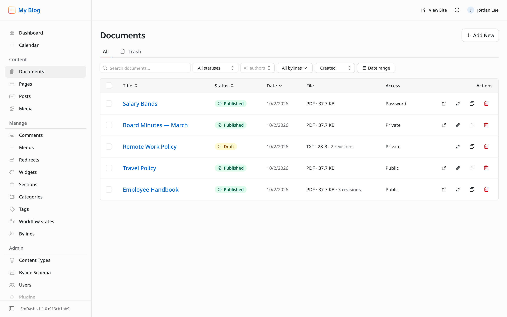
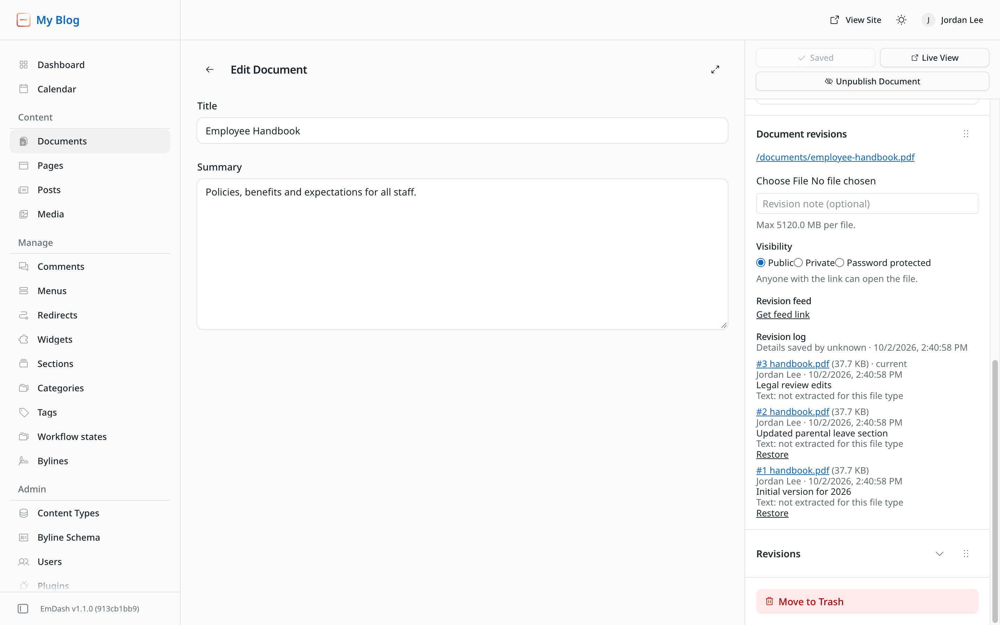
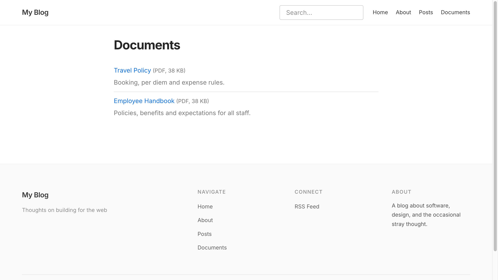

# EmDash Document Revisions

Document management for [EmDash](https://github.com/emdash-cms/emdash). Each document is a series of uploaded files with a revision log, and files are served only through permission-checked links. Think policies, handbooks, board minutes, contracts: files a team keeps updating, where people need the current version, the history of who changed what, and some documents kept private.

It's a TypeScript port of [WP Document Revisions](https://github.com/wp-document-revisions/wp-document-revisions), the WordPress plugin, for EmDash on Cloudflare Workers. If you're moving a WordPress site to EmDash, the [importer](#import-from-wordpress) brings your document library along, history and old links included.

> [!WARNING]
> **Early and unproven.** It's been built and tested end to end against EmDash 1.1 in Cloudflare's local runtime, but not yet run on a production Cloudflare deployment. APIs may change before 1.0, and it relies on a few EmDash internals that a future EmDash release could move (see [Upgrading](#upgrading)). Try it on a test site first, and please [report what you find](https://github.com/benbalter/emdash-document-revisions/issues). Not affiliated with EmDash or Cloudflare.

| The documents list, with file and access columns | The editor's Document revisions panel |
|---|---|
|  |  |



*What a visitor sees on the same site: the private and password-protected documents aren't listed at all.*

## Features

- **Versioned documents.** Every upload becomes a numbered revision with author, date and note. Restore any earlier revision.
- **Private storage.** Files live in their own R2 bucket and are reachable only through `/documents/…` links, which check permissions on every request, including Range requests from PDF viewers and media players.
- **Visibility per document:** public, private (Editors, Admins and the author) or password-protected. New documents are private by default, as in WP Document Revisions.
- **Stable links.** `/documents/tps-report.pdf` always serves the latest file; `/documents/tps-report-revision-3.pdf` serves revision 3. The dated `/documents/2011/08/…` form from WordPress works too.
- **Check-out locking** through EmDash's own edit lock. Nobody uploads over someone who's editing.
- **Large files.** Uploads up to 5 GB in resumable parts, with progress.
- **Revision feeds.** An Atom feed per document, authenticated with a per-user feed key, so you can follow changes in a feed reader.
- **Text extraction.** A queue extracts text from each upload: plain-text formats locally, and PDF, Office and images through [Workers AI](https://developers.cloudflare.com/workers-ai/features/markdown-conversion/) when bound.
- **Front-end blocks:** Document list, Latest documents (also a sidebar widget), Document revisions and Document preview.
- **Admin tools.** An editor panel, an Upload document page, File and Access columns in the documents list, and a Document settings page (default visibility, feed keys, storage cleanup).
- **Search** that includes public documents but never shows a visitor a private or password-protected title.
- **SSO-ready.** EmDash supports [Cloudflare Access](https://developers.cloudflare.com/cloudflare-one/policies/access/) logins, and every rule here uses EmDash's roles, so private documents work behind your SSO unchanged.

## Requirements

- An EmDash 1.1 site on **Cloudflare Workers**, with R2. The plugin uses Cloudflare bindings directly and doesn't run on EmDash's Node adapter yet ([why](docs/architecture.md#running-outside-cloudflare)).
- Node.js 22.16 or later and pnpm, to build and deploy.
- Optional: Cloudflare Queues (text extraction), the Workers rate-limit binding (password throttling), and Workers AI (PDF, Office and image text).
- Familiarity with editing `astro.config.mjs` and `wrangler.jsonc`. This is a native EmDash plugin, so there's no one-click install from EmDash's registry ([why](docs/architecture.md#why-a-native-plugin-not-a-sandboxed-one)).

## Quick start

This repository is a pnpm workspace: the plugin in [`plugin/`](plugin/), and a demo site in [`site/`](site/) built on EmDash's blog template.

```sh
pnpm install
pnpm dev             # starts astro dev; open the dev-bypass URL it prints to sign in
pnpm test            # unit and end-to-end tests; starts its own dev server
```

To add a document, use **Upload document** in the admin sidebar, or create a Document and use the **Document revisions** panel in the editor's sidebar.

**No network needed.** After `pnpm install`, local development works offline. `astro dev` runs the site in Cloudflare's own runtime (workerd, via Miniflare), and D1, R2, Queues and the rate limiter are emulated on disk under `site/.wrangler/`. No Cloudflare account or login is needed. The exceptions:
- the blog theme's Google Fonts download once into `site/.astro/fonts` (offline with an empty cache, the site falls back to system fonts);
- `pnpm test:import` downloads WordPress through Playground;
- a Workers AI binding, if you add one, is remote.

## Install into an EmDash site

Install the [package from npm](https://www.npmjs.com/package/emdash-document-revisions):

```sh
pnpm add emdash-document-revisions
```

It ships TypeScript source, which Astro compiles with the rest of your site, so there's nothing to build. Then:

1. **Register both halves** in `astro.config.mjs`. A native EmDash plugin can't add site routes, so the document links and API come from a separate Astro integration.
   ```js
   import { documentRevisions, documentRevisionsRoutes } from "emdash-document-revisions";
   // ...
   integrations: [
     emdash({ /* database, storage, … */ plugins: [documentRevisions()] }),
     documentRevisionsRoutes(),
   ],
   ```
2. **Add a `DOCUMENTS` R2 bucket** to `wrangler.jsonc`. It must be a **different bucket** from EmDash's media bucket, because EmDash serves every file in the media bucket to anyone who has its key.
   ```jsonc
   "r2_buckets": [
     { "binding": "MEDIA", "bucket_name": "my-site-media" },
     { "binding": "DOCUMENTS", "bucket_name": "my-site-documents" }
   ]
   ```
3. **Add the `documents` collection.** Plugins can't create collections, so your site needs one.
   - **New site:** copy the `documents` collection, the `workflow_state` taxonomy and the Documents menu link from [`site/seed/seed.json`](site/seed/seed.json) into your seed before the site's database is first created.
   - **Existing site:** EmDash applies seeds only to a new database, so run the setup script instead. It creates or repairs the collection, its fields and search, and the workflow states, and is safe to re-run:
     ```sh
     EMDASH_TOKEN=ec_pat_… node scripts/setup-collection.mjs --site https://your-site.example --dry-run
     EMDASH_TOKEN=ec_pat_… node scripts/setup-collection.mjs --site https://your-site.example
     ```
     The token needs the `admin` scope (**Settings → API tokens**, as an Administrator). Add `--no-workflow-states` to skip the taxonomy.
4. **Set `EMDASH_ENCRYPTION_KEY`.** EmDash already requires it; this plugin also signs password-protected documents' cookies with it.
5. **List documents safely in your own templates.** Use the Document list component, as [`site/src/pages/documents/index.astro`](site/src/pages/documents/index.astro) does, or filter `getEmDashCollection("documents")` through `filterPublicDocuments()` from `emdash-document-revisions/visibility`. A raw `getEmDashCollection("documents")` will show private and password-protected titles to everyone. (EmDash's own search is filtered for you.)
6. **Optional, recommended:**
   - **Text extraction.** Add a `DOC_JOBS` queue (producer and consumer) to `wrangler.jsonc`, and add the consumer to your Worker entry:
     ```ts
     import { documentRevisionsQueue } from "emdash-document-revisions/worker";
     export default { ...handler, scheduled: createScheduledHandler(), queue: documentRevisionsQueue };
     ```
     To extract PDF, Office and images too, bind Workers AI as `AI`.
   - **Password throttling.** Add a `DOC_PASSWORD_LIMIT` [rate-limit binding](https://developers.cloudflare.com/workers/runtime-apis/bindings/rate-limit/).

   [`site/wrangler.jsonc`](site/wrangler.jsonc) and [`site/src/worker.ts`](site/src/worker.ts) show both. Without them, those features switch off quietly.

### Deploy to Cloudflare

Create the resources your `wrangler.jsonc` names, then deploy as usual for EmDash. These steps haven't yet been run against a real deployment (see the status note above); please report anything that differs. With the demo site's names:

```sh
npx wrangler r2 bucket create my-emdash-documents
npx wrangler queues create document-jobs        # if you added text extraction
npx wrangler secret put EMDASH_ENCRYPTION_KEY   # if your site doesn't have it yet
pnpm --filter site run deploy                   # astro build && wrangler deploy
```

The rate-limit binding needs no setup beyond its `namespace_id`, any number unique within your account. If your site's D1 binding isn't named `DB`, set `DOCUMENT_D1_BINDING` (see below), or revision feeds will be refused.

### Configuration reference

| Name | Kind | Required | Purpose |
|---|---|---|---|
| `DOCUMENTS` | R2 bucket binding | Yes | Document files, revision manifests, settings and feed keys. Must not be the media bucket. |
| `EMDASH_ENCRYPTION_KEY` | Secret | Yes | Already required by EmDash; also signs password cookies. |
| `DOC_JOBS` | Queue (producer + consumer) | No | Text extraction after each upload. |
| `AI` | Workers AI binding | No | PDF, Office and image extraction (Markdown Conversion). Remote; incurs Workers AI usage. |
| `DOC_PASSWORD_LIMIT` | Rate-limit binding | No | Throttles password attempts per visitor and document (the demo allows 5 a minute). Cloudflare counts per location and approximately. |
| `DOCUMENT_MAX_FILE_BYTES` | Variable | No | Largest upload, default 5 GB. |
| `DOCUMENT_PASSWORD_ITERATIONS` | Variable | No | PBKDF2 cost for document passwords, default 20,000 (sized for Workers Free's CPU limit); 10,000–100,000. Raise it on Workers Paid. |
| `DOCUMENT_D1_BINDING` | Variable | No | Name of the site's D1 binding (default `DB`), used to refuse feed keys of disabled accounts. Without a readable D1 database, feeds are refused. |

## Using it

- **Upload.** Use **Upload document** in the admin sidebar for a new document, or the **Document revisions** panel in the editor's sidebar for a new version. EmDash only shows editor panels on saved entries. Files over 95 MB upload in parts automatically.
- **Publish.** A document is a normal EmDash entry: visitors can open it only once it's published, and then its visibility decides who can.
- **Revision log and restore.** The panel lists every file revision, plus EmDash's own edits to the title and other fields. **Restore** re-instates an older file as a new revision, so nothing is ever lost.
- **Visibility.** Set it per document in the panel. Admins set the default for new documents on **Document settings**.
- **Locking.** While someone has a document open in the editor, others can't upload, restore or change visibility. EmDash's editor shows who holds the lock and lets users take it over.
- **Feeds.** **Get feed link** in the panel creates your personal feed key. It's shown once, and you can replace or revoke it.
- **Blocks.** Type `/` in any rich-text field and choose **Document list**, **Latest documents**, **Document revisions** or **Document preview**. Latest documents also works in a sidebar widget area (as a content widget).
- **Document settings** (Admins):
  - the default visibility;
  - "Revoke all feed keys";
  - storage usage;
  - cleanup of files whose documents are gone;
  - "Delete all document files" before you remove the plugin.

### Who can do what

| | Visitor | Subscriber | Contributor | Author | Editor / Admin |
|---|---|---|---|---|---|
| Open a published, public document | ✓ | ✓ | ✓ | ✓ | ✓ |
| Open a password-protected document | with password | with password | with password | own: ✓, others: with password | ✓ |
| Open a private document | — | own | own | own | ✓ |
| Open drafts and past revisions | — | — | ✓¹ | ✓¹ | ✓ |
| Upload, restore, change visibility | — | — | — | own | ✓ |
| Create documents with files (Upload document page)² | — | — | — | ✓ | ✓ |
| Get a revision-feed key | — | — | ✓ | ✓ | ✓ |
| Document settings, storage cleanup, WordPress import | — | — | — | — | Admin |

¹ Never more than the document's own visibility allows. Past revisions of a private document still need Editor or authorship, and of a password-protected one, the password or edit rights.
² Contributors can create document entries through EmDash's own screens (core's `content:create`), but attaching files takes Author.

Anything a viewer can't open returns a 404, so slugs don't leak. The same rules apply to the revision log, extracted text, feeds, list columns and front-end blocks.

## Import from WordPress

The importer moves documents with their full history. Every revision keeps its WP Document Revisions number, author, date and note, so old links like `/documents/2011/08/tps-report-revision-3.pdf` keep working.

1. **Export on the WordPress server**, where the document files are readable:
   ```sh
   wp eval-file scripts/wpdr-export.php ./wpdr-bundle
   ```
   - The export writes `wpdr-bundle/export.json` and `wpdr-bundle/files/`.
   - Add `--include-trash` to include trashed documents.
   - If a document file is missing on disk, the export stops and lists it; `--allow-missing` exports without those revisions.
   - Tested with WP Document Revisions 5.7, including a document upload directory outside the web root.

   WordPress's own export (WXR) can't do this: it leaves out post revisions, which are the revision log, and its attachment URLs point at files the plugin keeps private.

   > **The bundle is sensitive.** `export.json` holds WordPress's plaintext post passwords and users' emails, and `files/` holds every private document. Keep it off shared storage, never commit it, and delete it after importing.
2. **Create an API token** in EmDash (**Settings → API tokens**) with the `admin` scope, as an Administrator. Imports set authors and dates and look users up by email.
3. **Import:**
   ```sh
   EMDASH_TOKEN=ec_pat_… node scripts/import-wpdr.mjs ./wpdr-bundle --site https://your-site.example --dry-run
   EMDASH_TOKEN=ec_pat_… node scripts/import-wpdr.mjs ./wpdr-bundle --site https://your-site.example
   ```

| WordPress | EmDash |
|---|---|
| Title, slug, description, created and published dates | Entry title, slug, summary, `createdAt` / `publishedAt` |
| Document author | Entry owner, when an EmDash user has the same email; otherwise the importing Admin, with the WordPress name kept on each revision |
| Every revision: number, author, date, excerpt (the log note) | One revision each, numbered the same. Revisions that only changed the title or note share the previous file, stored once. |
| Published / private / password-protected / draft / scheduled / trashed | Published + public / published + private / published + password (the plaintext WordPress password is hashed on import) / draft / scheduled / trashed |
| Workflow states | `workflow_state` terms, created if missing |

Files over 95 MB are imported in parts. Documents with a file over the size limit (5 GB by default) are reported and skipped before anything is created. Re-running is safe:
- documents already imported (matched by WordPress ID) are skipped;
- a slug already used by another EmDash document is reported and left alone.

File names become `slug.ext`, as WP Document Revisions serves them, because WordPress renamed uploads to an MD5 hash and the original names are gone.

## Parity with WP Document Revisions

| WP Document Revisions | Here |
|---|---|
| `document` post type | `documents` collection in the seed (plugins can't create collections) |
| File per revision, revision log | An R2 object per upload, with a manifest of number, author, note, size and time |
| Restore a revision | Appends the old file as a new revision ("Restored revision N"), as WordPress does |
| Permalinks, including `-revision-N` and dated forms | Same URL shapes; extensionless links and wrong extensions also resolve |
| Files hashed and stored outside the web root | Random object keys in a separate, private R2 bucket |
| Public / private / password-protected, private by default | Same, per document; PBKDF2-hashed passwords with a 10-day HttpOnly cookie, invalidated when the password changes |
| Check-out lock and takeover | EmDash's entry edit lock (no takeover email yet: EmDash has no takeover hook) |
| Revision RSS feed with per-user key | Atom feed, key stored hashed, role checked on every request |
| `[documents]`, `[document_revisions]`, `[document_preview]`, Latest Documents widget | Portable Text blocks; Latest documents also works as a content widget |
| Admin list columns | File and Access columns |
| Text extraction | Queue-driven; Workers AI for PDF, Office and images |
| Workflow states | A taxonomy |
| Trash, delete, uninstall cleanup | Trash keeps files, permanent delete removes them, Document settings handles the rest |

Still to come: email notifications, configurable permalink base, diffs and AI summaries, and more. See [ROADMAP.md](ROADMAP.md).

## Troubleshooting

- **A visitor gets a 404 for a document I just published.** New documents are private by default. Set the document to **Public** in the editor's Document revisions panel, or change the default on **Document settings**. The 404 (rather than a 403) is deliberate, so private slugs don't leak.
- **"… is editing this document" (409) when uploading or restoring.** Someone has the document open in EmDash's editor. Wait for them to close it, or take over the lock from the editor.
- **"Can't verify the document's edit lock" (503) on every upload.** The plugin couldn't reach EmDash's edit-lock check, most likely after an EmDash upgrade. Writes are refused rather than risk overwriting someone's work; see [Upgrading](#upgrading).
- **"Text: not extracted (no processing queue configured)".** Text extraction is optional and needs a `DOC_JOBS` queue plus `queue: documentRevisionsQueue` in your Worker entry (install step 6). "needs a Workers AI binding" means the same for PDF, Office and image files, which also need `AI`. Files uploaded before you add them aren't re-processed.
- **"Text: processing…" doesn't finish.** The queue is bound but its consumer isn't running: check that the Worker entry exports `queue` and that `wrangler.jsonc` has a consumer for the queue.
- **Revision feed links return 404.** The feed checks that the key's owner still has an active account, which needs the site's D1 database. If your binding isn't named `DB`, set `DOCUMENT_D1_BINDING`.
- **Private document titles show up on a page I built.** That page lists documents without filtering them; see install step 5.
- **The Documents collection is missing on an existing site.** Seeds only apply to new databases; run [`scripts/setup-collection.mjs`](scripts/setup-collection.mjs) (install step 3).

## Backups

Document files and revision logs live in the `DOCUMENTS` R2 bucket, not in EmDash's database, so **EmDash's export and database backups don't include them.** Back the bucket up separately, for example with [rclone](https://developers.cloudflare.com/r2/examples/rclone/) over R2's S3 API. A full restore needs both the database (entries, titles, owners) and the bucket (files and logs).

## Costs

Everything runs within your own Cloudflare account; there's no service to sign up for. R2, Queues, the rate limiter and D1 all have free allowances that a small document library is unlikely to exceed. Costs that can grow with use:
- **R2 storage.** Every revision is kept, so storage grows with each upload. Document settings shows current usage.
- **Workers AI**, if you bind `AI` for PDF and Office extraction. It's billed per use; leave it unbound to avoid it.
- **CPU on Workers Free.** Password checks and large uploads use CPU time; see `DOCUMENT_PASSWORD_ITERATIONS`.

Check Cloudflare's current [Workers](https://developers.cloudflare.com/workers/platform/pricing/), [R2](https://developers.cloudflare.com/r2/pricing/) and [Workers AI](https://developers.cloudflare.com/workers-ai/platform/pricing/) pricing for your plan.

## Upgrading

To keep its security model, the plugin relies on a few EmDash details that aren't part of the plugin API:
- **the edit-lock check**, called through an internal package export;
- **the public plugin route handler**, called in-process to authorize revision feeds;
- **the `users.disabled` column** in EmDash's D1 database, read to refuse feed keys of disabled accounts;
- **the shape of EmDash's search responses**, which the plugin filters.

Plugin APIs that would replace the lock check and the search filter are drafted in [docs/upstream-requests.md](docs/upstream-requests.md). An EmDash upgrade could break any of them, and if one does, the plugin fails closed: uploads, restores and visibility changes are refused (503), feeds stop working, and search returns no results. Nothing private is exposed. So:
- pin your `emdash` version, and upgrade EmDash and this plugin together;
- after upgrading, upload a test revision before relying on it.

## Uninstalling

EmDash doesn't run uninstall hooks for native plugins, so clean up by hand:
1. On **Document settings**, use **Delete all document files**. It deletes every file, revision log and feed key; only the plugin's small settings file is left.
2. Remove `documentRevisions()` and `documentRevisionsRoutes()` from `astro.config.mjs`, and the bindings from `wrangler.jsonc`. Redeploy.
3. Optionally delete the bucket (R2 only deletes empty buckets, so remove the leftover settings file first, e.g. in the Cloudflare dashboard), the queue, and the `documents` collection and its entries in EmDash.

## Limitations

The main differences from WP Document Revisions, and from what you might expect of a one-click plugin:
- **Cloudflare only** for now; no Node or self-hosted EmDash.
- **Native, not sandboxed.** It runs with full access to your site, as every native EmDash plugin does, so install it only from a source you trust.
- **Template listings need a filter** (install step 5). EmDash has no per-entry read rules, so the plugin can't hide private documents from your own queries.
- **Fixed roles.** EmDash's five roles can't be extended, so there's no `read_private_documents`-style custom capability.
- **No email yet:** no notifications on new revisions, and no email when someone takes over a lock.
- **No permalink base setting** yet; documents live under `/documents/`.

[docs/architecture.md](docs/architecture.md) explains each of these, the plugin's internals and its API.

## Testing

The tests use [Vitest](https://vitest.dev) and run offline, except the importer suite. [GitHub Actions](.github/workflows/test.yml) runs them on every push and pull request.

- `pnpm test:unit` runs about 440 tests in Cloudflare's own runtime (workerd) with a local R2 bucket, in about a second:
  - the access rules, as a table of every role, authorship, visibility, status and revision case, checked against the [Who can do what](#who-can-do-what) table;
  - password hashing, including hashes from before the cost was stored, and password cookies;
  - the store: revision-log compare-and-swap under a simulated race, default visibility, the slug index, deletes, storage usage and feed keys;
  - text extraction and its queue consumer, including size limits, truncation and retries;
  - permalink parsing, Range and `If-None-Match`;
  - the search filter, including failing closed when EmDash's response looks unfamiliar.
- `pnpm test:integration` runs about 170 end-to-end tests over HTTP against the demo site. It starts its own `astro dev` on port 4330, with its own local data under `site/.wrangler-test/`, so it never touches the data `pnpm dev` uses. Each role is a real user with its own session. The tests cover:
  - permalinks, plus Range and conditional requests;
  - public, private, password and draft access for every role;
  - cache headers;
  - single and multipart uploads, including 150 MiB round trips;
  - restore;
  - EmDash edit-lock refusals and the lock check failing closed;
  - ownership;
  - trash and permanent delete;
  - recycled slugs;
  - CSRF;
  - API-token scopes;
  - password throttling;
  - text extraction;
  - default visibility;
  - list columns;
  - search results for each role;
  - revision feeds and keys, including disabled accounts;
  - storage cleanup;
  - the front-end blocks, as a visitor, a subscriber and an admin.
- `pnpm test:import` runs 36 tests of the [WordPress importer](#import-from-wordpress) on port 4331. It needs network, and isn't part of `pnpm test`; CI runs it nightly and whenever the importer changes.
  - It seeds a real WordPress with the released WP Document Revisions in [Playground](https://wordpress.org/playground/), using a document directory outside the web root.
  - It exports, imports twice, and checks files, revision numbers, authors, notes, visibility, status, workflow states, oversize handling and idempotency.
- `pnpm test` runs the unit and integration suites; `pnpm typecheck` type-checks the plugin and the tests.

Run one file with `pnpm vitest run tests/integration/feeds.test.ts`, or one test with `-t "feed with the key"`. Set `EDR_DEV_LOG=1` to see the dev server's output. The suites write straight to their own dev server's database (roles, lock rows), so never point them at a real site.

## Contributing

Issues and pull requests are welcome. Before opening a PR:
- run `pnpm typecheck` and `pnpm test`, and `pnpm test:import` if you touched the importer;
- add tests for new behavior.

Explain *why* in commit messages and PR descriptions. [ROADMAP.md](ROADMAP.md) lists what's planned, with estimates.

### Releasing

Release only after the owner approves it: pushing the tag publishes to npm.

1. Bump `version` in [`plugin/package.json`](plugin/package.json) in a pull request and merge it.
2. Tag the merge commit and push the tag:
   ```sh
   git tag -a v0.3.0 -m v0.3.0 && git push origin v0.3.0
   ```

The [Release workflow](.github/workflows/release.yml) checks the tag matches the package version, runs the typecheck and tests, publishes to npm with provenance through [trusted publishing](https://docs.npmjs.com/trusted-publishers) (no npm token is stored), and creates the GitHub release.

## Security

Please report vulnerabilities privately through GitHub's **Security → Report a vulnerability**, not in a public issue.

## License

[MIT](LICENSE). WP Document Revisions, the WordPress plugin this ports, is GPL-licensed; no code from it is included here.
